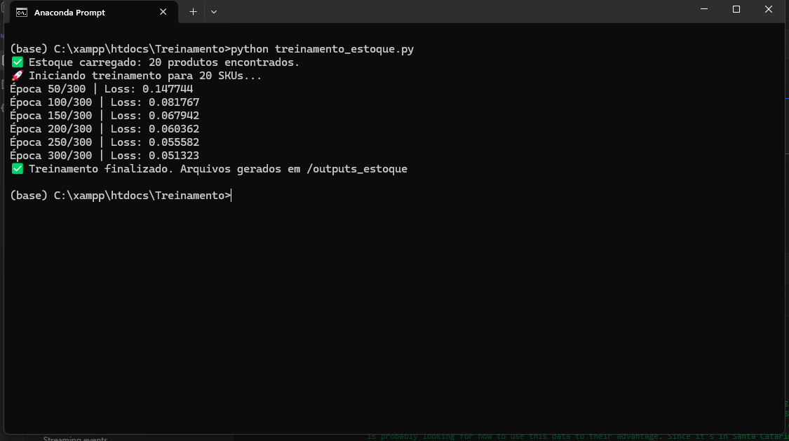
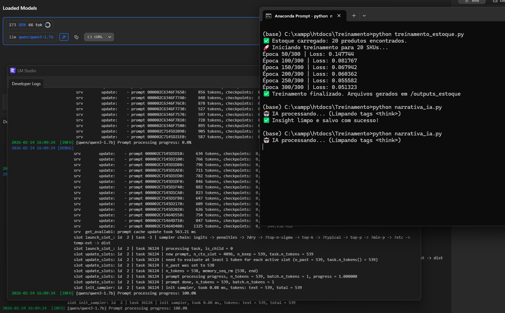
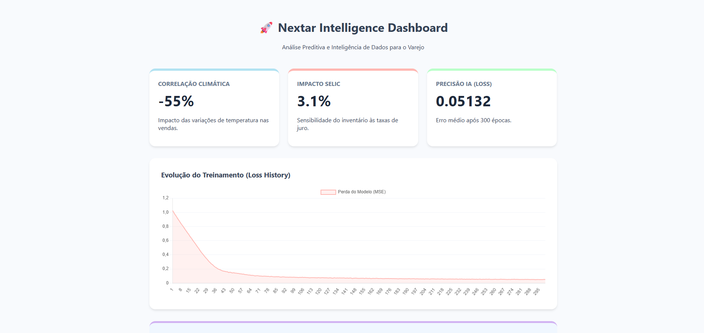
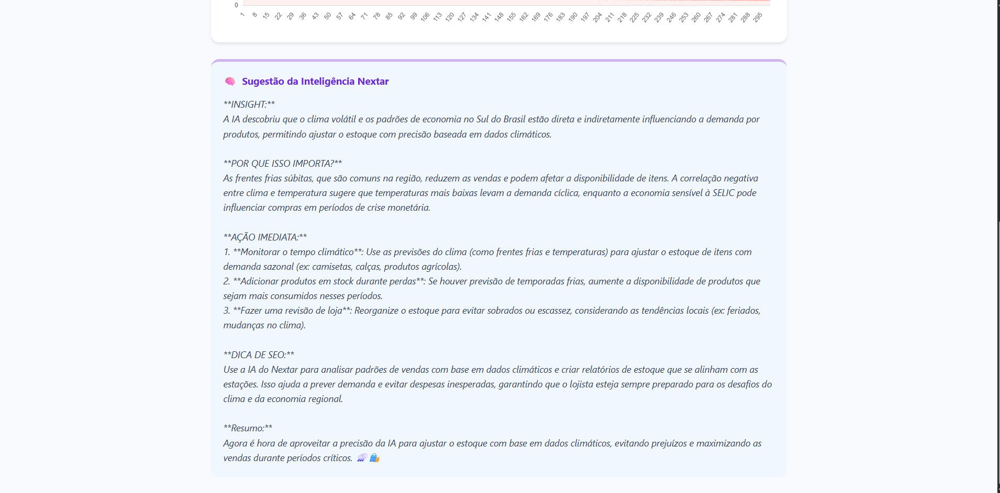

Nextar Dashboard
Deep Learning • Business Intelligence • Generative AI

====================================================================

        VISÃO GERAL

Nextar Intelligence é um ecossistema de análise preditiva para o varejo que combina:

- Deep Learning para previsão de demanda
- IA Generativa para tradução estratégica de métricas
- Dashboard administrativo para tomada de decisão

O sistema elimina o ruído entre ciência de dados e operação comercial,
transformando correlações estatísticas em ações práticas para o lojista.

Projetado considerando variáveis macroeconômicas e regionais como:

- Variações climáticas de Curitiba/PR
- Oscilações da taxa SELIC

====================================================================

        ARQUITETURA DO SISTEMA

Data Layer → Intelligence Layer → Decision Layer

====================================================================

1) NÚCLEO DE DEEP LEARNING
/treinamento_estoque.py

  

------------------------------------------------------------

ENGENHARIA DE DADOS (Data Enrichment)

- Geração de 365 dias de dados sintéticos
- Simulação de impacto climático
- Simulação de impacto da SELIC
- Correlação entre preço, clima e volume de vendas

------------------------------------------------------------

MODELO: NextarDeepStock

- PyTorch
- Camadas Lineares
- ReLU
- Dropout 20%
- Treinamento supervisionado

------------------------------------------------------------

NORMALIZAÇÃO

- Z-Score
- Equalização de escala entre variáveis como:
  * Preço
  * Temperatura
  * Indicadores econômicos

====================================================================

2) CAMADA DE INTELIGÊNCIA NARRATIVA
/narrativa_ia.py

Transforma métricas técnicas em recomendações executivas.

  

------------------------------------------------------------

PROCESSAMENTO LOCAL

- Integração com LM Studio
- Execução offline
- Dados sensíveis mantidos localmente

------------------------------------------------------------

PÓS-PROCESSAMENTO

- Filtro Regex
- Remoção de tags como think
- Output limpo para dashboard

------------------------------------------------------------

ESTRATÉGIA DE NEGÓCIO

- Análise de correlação clima x vendas
- Sugestão de promoções contextuais
- Foco no mercado do Sul do Brasil

====================================================================

3) INTERFACE DE DECISÃO
/index.php

Dashboard administrativo orientado a clareza visual.

------------------------------------------------------------

DESIGN

- Interface minimalista
- Paleta pastel
- Foco em legibilidade

------------------------------------------------------------

VISUALIZAÇÃO

- Chart.js
- Curva de Loss
- Monitoramento de precisão do treinamento

------------------------------------------------------------

MÉTRICAS EM TEMPO REAL

- Consumo de JSON e CSV
- Exibição de:
  * Correlação climática
  * Impacto financeiro
  * Histórico de desempenho

  

    

  

====================================================================

        INSTALAÇÃO

1) Clone o repositório

git clone [https://github.com/seu-usuario/nextar-intelligence.git](https://github.com/skora09/Nextar-Intelligence-Dashboard)
cd nextar-intelligence-Dashboard

2) Instale dependências Python

pip install pandas numpy torch matplotlib openai

3) Execute o treinamento

python treinamento_estoque.py

4) Gere os insights narrativos

Certifique-se que o LM Studio está ativo.

python narrativa_ia.py

5) Execute o servidor PHP

Configure Apache ou Nginx apontando para:

/web

====================================================================

        DIFERENCIAIS TÉCNICOS

- Separação clara entre ML e camada de apresentação
- IA Generativa local para proteção de dados
- Simulação de variáveis macroeconômicas
- Arquitetura pronta para automação futura
- Design orientado a tomada de decisão

====================================================================

        AUTOR

Projeto desenvolvido por Guilherme Lopuch como demonstração de capacidade técnica em:

- Engenharia de Machine Learning
- Integração com IA Generativa
- Arquitetura Full Stack
- Aplicação prática de modelos preditivos no varejo

====================================================================
    

    

